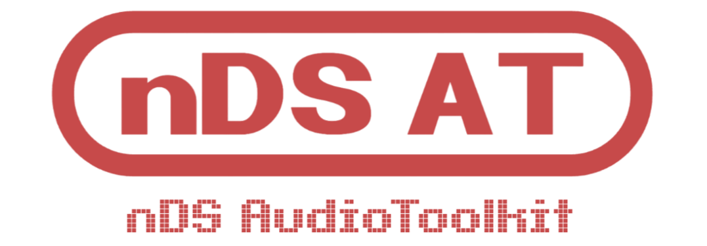

<div align="center">



# nDS Audio Toolkit (nDSAT)

A Nintendo DS ROM audio file extracting & converting tool.

</div>

---

## About

nDS Audio Toolkit enables you to listen to all sounds within any DS ROM of your choosing. Initially created to supplement my own nDS modification project, [NSMB+](https://github.com/Liam-GH/NSMBplus).

---

## Tools

| Script | Purpose |
|--------|---------|
| `extract.py` | Extracts all audio archives from any DS ROM |
| `convert.py` | Batch converts SWAR archives to WAV for listening |
| `devtools/find_match.py` | Finds WAV files matching a target duration |

---

## Requirements

- Python 3
- `ndspy`
- `vgmstream-cli` — `brew install vgmstream` on Mac, or download from [vgmstream.org](https://vgmstream.org) on Windows

```bash
pip3 install ndspy
```

---

## How to Use

1. Place your DS ROM in the same folder as the scripts

2. Extract all audio archives from the ROM:
```bash
python3 extract.py your_rom.nds
```
Creates an `output` folder containing all SWAR files.

3. Convert all SWAR files to WAV for listening:
```bash
python3 convert.py
```
Creates a `WAV` folder with every individual sound as a separate WAV file.

4. To find a clip by duration:
```bash
python3 devtools/find_match.py ~/path/to/WAV-folder 0.660 KEYWORD
```
Replace `KEYWORD` with a filename filter e.g. `LUIGI`.

---

<div align="center">

*Firmware, software, and published games under the Nintendo company are all original intellectual property of Nintendo. All rights reserved. No game files are included or distributed.*

</div>
